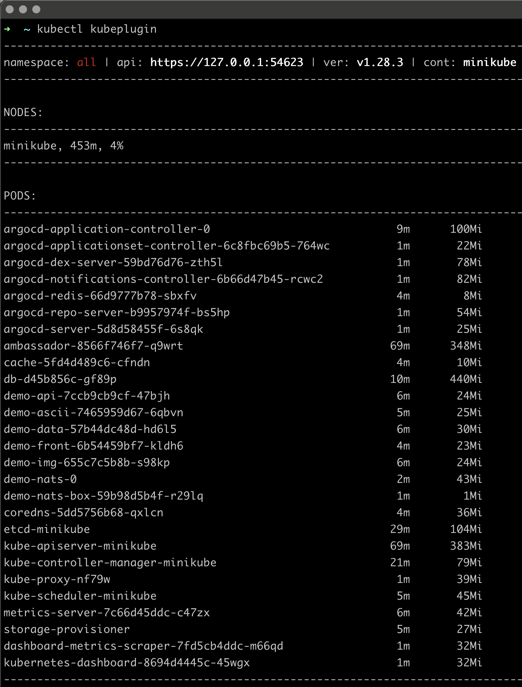
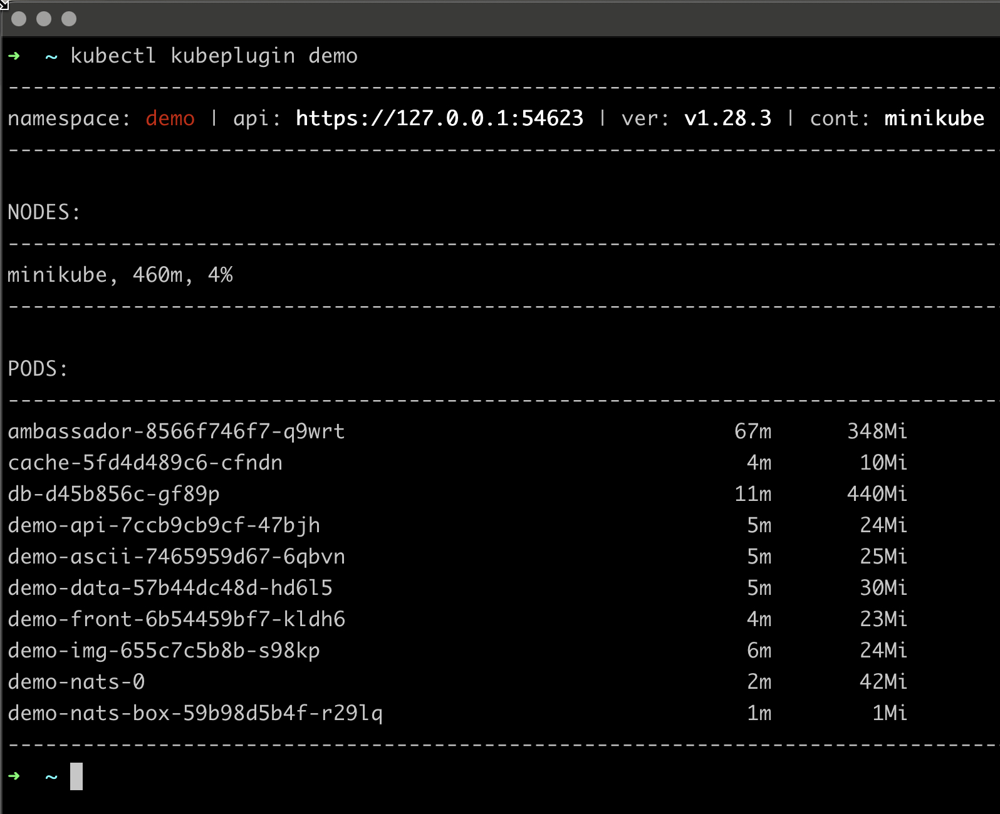

# Before you begin
You need to have a working ```kubectl``` binary installed.

# Install
- Install the ```jq``` command-line JSON processor https://jqlang.github.io/jq/
- create folder for the plugin ```mkdir ~/kplugins``` \
I use the **~/kplugins** folder, you may change it according your needs.
- add folder to the **PATH** variable
- copy plugin file to your system \ 
 ```curl https://raw.githubusercontent.com/alexanderlukjanenko/kubectl-plugin/main/scripts/kubectl-kubeplugin -o ~/kplugins/kubectl-kubeplugin```
- add executable rights \
```chmod u+x ~/kplugins/kubectl-kubeplugin```
- test
```kubectl kubeplugin --help```

# Usage
- as bash script \
    ```bash kubectl-kubeplugin```
- as kubectl plugin
    ```kubectl kubeplugin```

# Parameters
- no parameters to see the data for all namespaces
- name of the namespace to filte data by namespace
    ```kubectl kubeplugin kube-system```

# Demo
- no parameters \


- filter by **demo** namespace \

